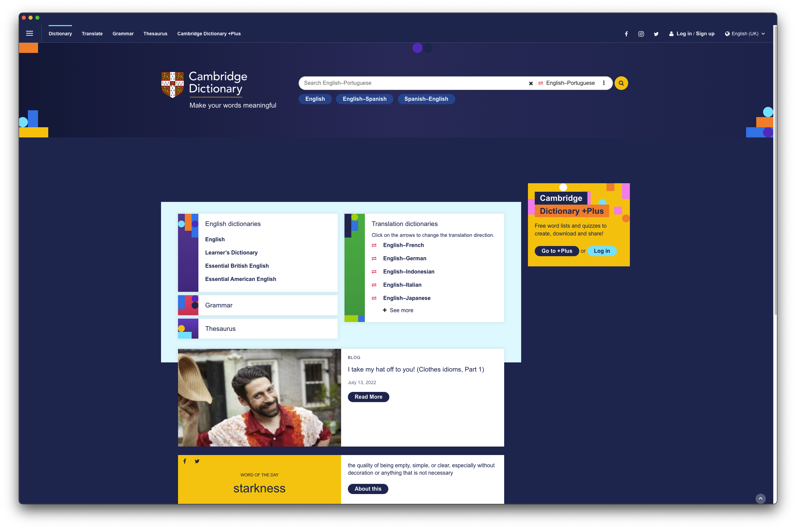

# Cambridge Dictionary Desktop App :book:

This is a simple app written in [Electron](https://electronjs.org) which inserts the [Cambridge Dictionary](https://dictionary.cambridge.orgt) website into an iframe, allowing you to browse the dictionary and search for words.

**Disclaimer**: This is **not** an official repository since I'm just a guy who uses this dictionary too much and I thought a desktop app would be a good idea for my case of usage.

:camera: Screenshot:

Upcoming changes for the repository

- [x] Electron up and running
- [ ] Create a build for macOS (maybe with [electron-builder](https://www.electron.build/), gotta think about it first)
- [ ] Create a build for Linux
- [ ] Create a build for Windows